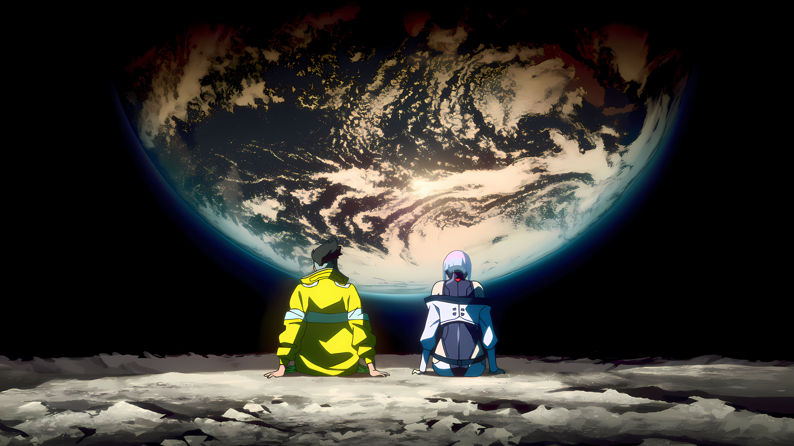
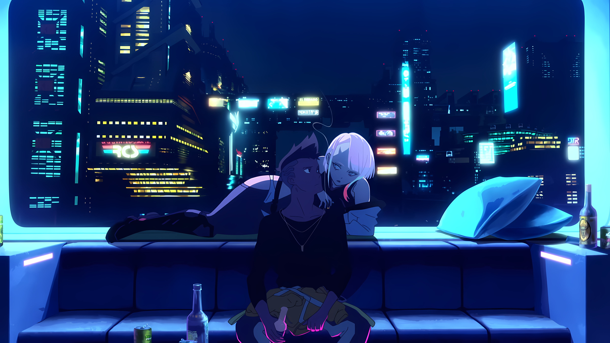
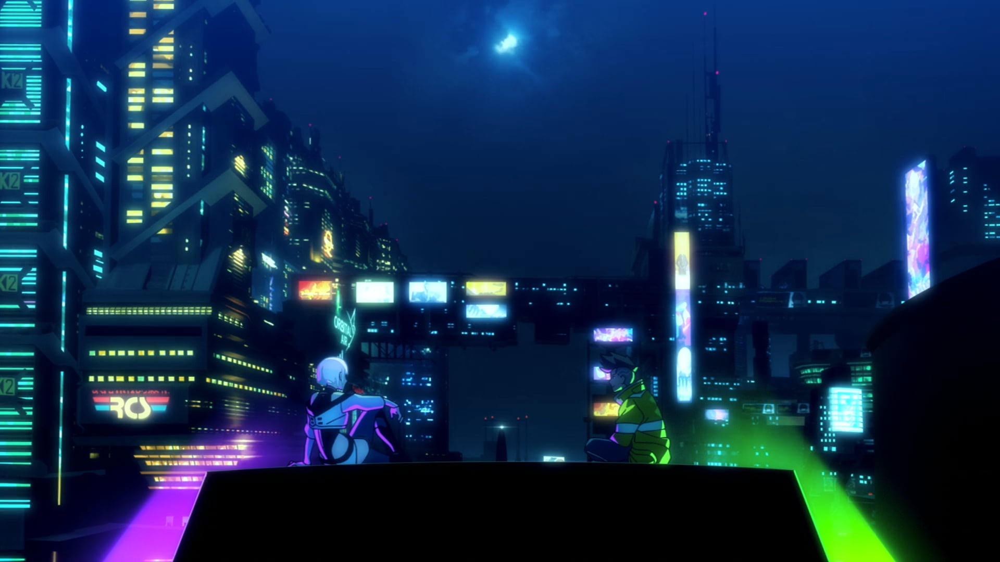
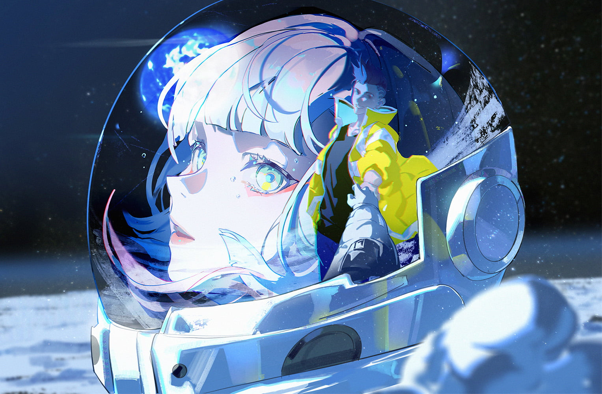
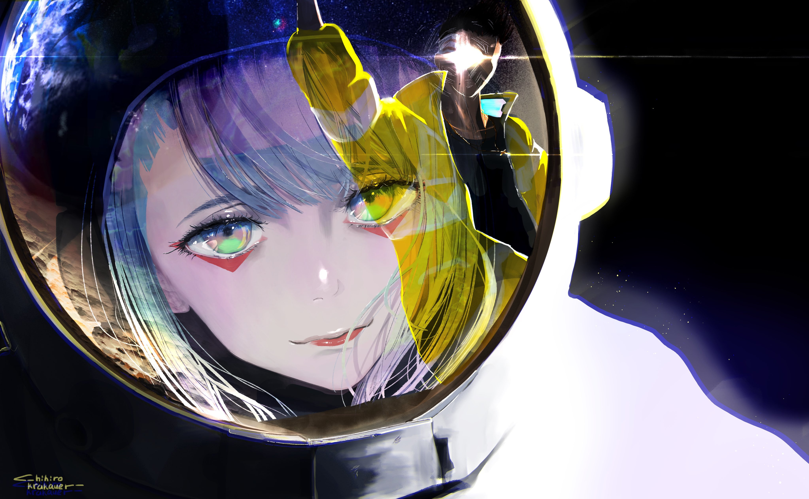
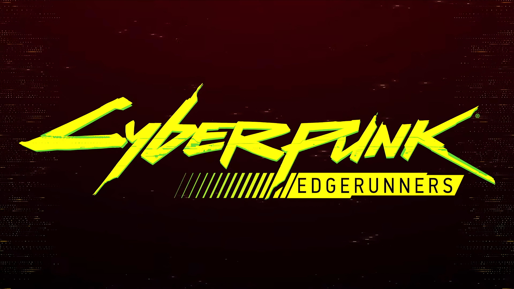
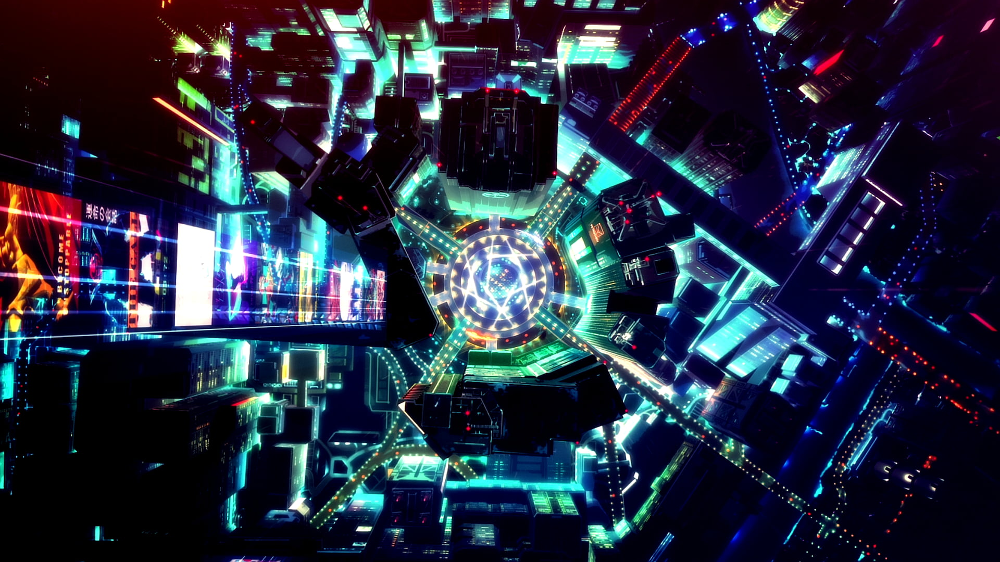
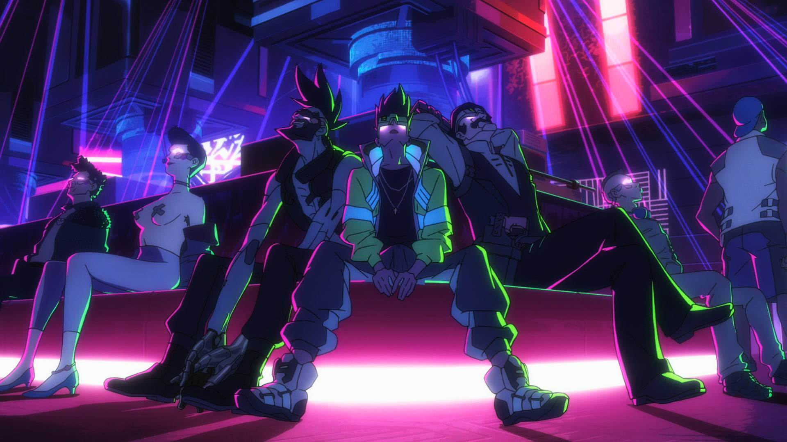
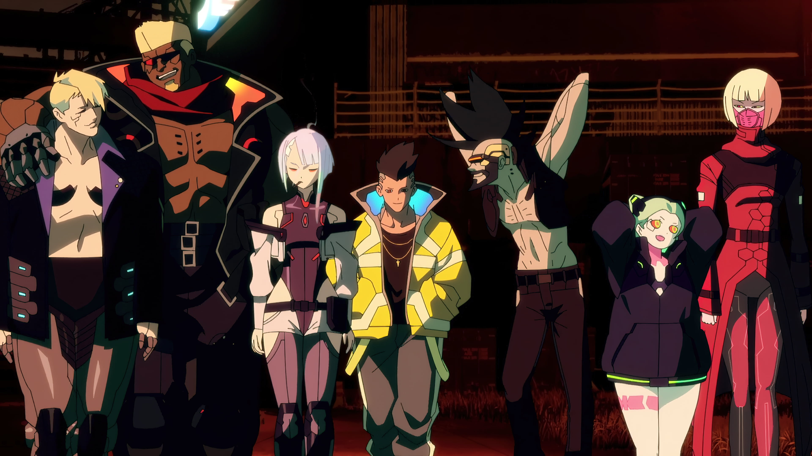

# Omarchy Cyberpunk Edgerunners Theme

Cyberpunk Edgerunners is a dark futuristic Omarchy theme inspired by Studio Trigger and CD Projekt Red's *Cyberpunk: Edgerunners*, featuring iconic Cyberpunk neon yellow, luminous cyan, and vivid fuchsia/hot pink accents against a deep Night City dark purple void (`#26173E`). Rounded glass surfaces with glowing chromatic cyberware borders and luminous UI treatments capture the electric atmosphere of Night City.

## Preview


## Install

### Option 1: Complete local install (Recommended)
For a complete install with automatic backups, VS Code theme extension synchronization, transparent background window rules, and a clean uninstall path, run:

```bash
./install.sh
```

- Installs Cyberpunk Edgerunners as an Omarchy theme matching official template specifications.
- Configures Kitty, Alacritty, Ghostty, Foot, and Warp with clean transparent backgrounds (`background_opacity 0.80`).
- Configures Hyprland with chromatic border gradients (`#DA11C9` -> `#FFFF4C` -> `#1BD7F8`) and transparency rules for VS Code, Cursor, and VSCodium.
- Automatically generates and synchronizes the rich Cyberpunk Edgerunners color theme extension for VS Code / Cursor.
- Creates automatic backups of previous theme, wallpaper, and editor settings.

Restore previous configuration at any time with:

```bash
./uninstall.sh
```

### Option 2: Standard Omarchy installer
To install directly from the remote git repository:

```bash
omarchy-theme-install https://github.com/Johnyyd/omarchy-cyberpunk-edgerunners-theme
```

## What's Included

- **Hyprland Window Rules**: Window transparency rules (`0.80` active, `0.75` inactive) for VS Code, Cursor, VSCodium, Antigravity IDE, GitHub Desktop, Obsidian, Zed, Discord, Slack, Telegram, Spotify, and Nautilus.
- **Terminals**: Clean transparent background configurations (`0.80` opacity, blur disabled) for Kitty, Alacritty, Ghostty, Foot, and Warp.
- **TUIs & Monitors**: Native transparent terminal backgrounds for `btop` (`main_bg=""`), `helix` (`ui.background={}`), and `neovim`. Custom meter gradients and audio waveforms in `btop` and `cava`.
- **VS Code / Cursor / VSCodium**: Full multi-color syntax highlighting (`vscode-theme.json`) covering TextMate scopes and semantic tokens:
  - **Keywords & Control Flow**: `#ED4BA8` (Lucy Hot Pink)
  - **Functions & Methods**: `#FFFF4C` (Cyberpunk Neon Yellow)
  - **Types & Interfaces**: `#B03DCE` (Neon Orchid)
  - **Strings & Secondary Accents**: `#DA11C9` (Vivid Neon Fuchsia)
  - **Variables & Parameters**: `#1BD7F8` (Vivid Electric Cyan)
  - **Numbers & Constants**: `#EAE43E` (Acid Lime Yellow)
  - **Comments & Documentation**: `#3D99CA` (Steel Blue)
- **Editors & TUIs**: Native configurations for Neovim (`aether.nvim` v3 with LazyVim), Helix, Zed, Pi, and Claude CLI.
- **Fastfetch**: Custom Cyberpunk Edgerunners logo with neon fuchsia, yellow, and electric cyan color accents (`fastfetch.jsonc`).
- **Desktop Integrations**: Styled layouts for Waybar, Mako, Walker, SwayOSD, and Hyprlock.
- **Vencord Theme**: Standalone [Vencord theme](vencord.theme.css) with custom layered treatment for Discord.

### Fastfetch Theme Setup

Apply the Cyberpunk Edgerunners logo and color scheme to Fastfetch:

```bash
./install-fastfetch-logo.sh
```

To restore your previous Fastfetch configuration or system default:

```bash
./uninstall-fastfetch-logo.sh
```

## Wallpapers

### Static Wallpapers

<table>
  <tr>
    <td></td>
    <td></td>
    <td></td>
  </tr>
  <tr>
    <td></td>
    <td></td>
    <td></td>
  </tr>
  <tr>
    <td></td>
    <td></td>
    <td></td>
  </tr>
</table>

### Live Wallpapers (.mp4)

The theme includes 4 animated video wallpapers located in `backgrounds/`:

- `david-x-lucy-neon-afterglow-cyberpunk-edgerunners-moewalls-com.mp4` (David & Lucy Neon Afterglow)
- `lucy-and-david-sitting-on-the-moon-cyberpunk-edgerunners-moewalls-com.mp4` (David & Lucy on the Moon)
- `lucyna-astronaut-cyberpunk-edgerunners-moewalls-com.mp4` (Lucyna Astronaut)
- `lucy-x-rebecca-wuthering-waves-x-cyberpunk-edgerunners-moewalls-com.mp4` (Lucy & Rebecca)

These looping video wallpapers are directly compatible with the [Omarchy Live Wallpaper plugin](https://github.com/yesheytenzin/live-wallpaper). Once the plugin is installed:
1. Open **Style → Background** (or double-click an empty area on your desktop).
2. Select any video preview to start playback immediately.

## Requirements

- Omarchy 4.0 (Quattro) for native shell and Hyprland Lua treatment
- `Yaru-magenta` icon theme

