# Omarchy Reze Theme

Reze is a dark atmospheric Omarchy theme inspired by Tatsuki Fujimoto's *Chainsaw Man* (*Reze Arc*), featuring iconic Reze slate violet hair, crisp lavender-white, sage green, and vivid bomb crimson/spark yellow accents against a deep dark purple void (`#26173E`). Rounded glass surfaces with glowing chromatic borders and luminous UI treatments capture the delicate yet explosive atmosphere of the Bomb Devil.

## Preview


## Install

### Option 1: Complete local install (Recommended)
For a complete install with automatic backups, VS Code theme extension synchronization, transparent background window rules, and a clean uninstall path, run:

```bash
./install.sh
```

- Installs Reze as an Omarchy theme matching official template specifications.
- Configures Kitty, Alacritty, Ghostty, Foot, and Warp with clean transparent backgrounds (`background_opacity 0.80`).
- Configures Hyprland with chromatic border gradients (`#46416A` -> `#855E8D` -> `#94BA81`) and transparency rules for VS Code, Cursor, and VSCodium.
- Automatically generates and synchronizes the rich Reze color theme extension for VS Code / Cursor.
- Creates automatic backups of previous theme, wallpaper, and editor settings.

Restore previous configuration at any time with:

```bash
./uninstall.sh
```

### Option 2: Standard Omarchy installer
To install directly from the remote git repository:

```bash
omarchy-theme-install https://github.com/Johnyyd/omarchy-reze-theme
```

## What's Included

- **Hyprland Window Rules**: Window transparency rules (`0.80` active, `0.75` inactive) for VS Code, Cursor, VSCodium, Antigravity IDE, GitHub Desktop, Obsidian, Zed, Discord, Slack, Telegram, Spotify, and Nautilus.
- **Terminals**: Clean transparent background configurations (`0.80` opacity, blur disabled) for Kitty, Alacritty, Ghostty, Foot, and Warp.
- **TUIs & Monitors**: Native transparent terminal backgrounds for `btop` (`main_bg=""`), `helix` (`ui.background={}`), and `neovim`. Custom meter gradients and audio waveforms in `btop` and `cava`.
- **VS Code / Cursor / VSCodium**: Full multi-color syntax highlighting (`vscode-theme.json`) covering TextMate scopes and semantic tokens:
  - **Keywords & Control Flow**: `#FF003C` (Bomb Devil Crimson) & `#FE4646` (Blast Coral)
  - **Functions & Methods**: `#EAE43E` (Detonation Spark Yellow)
  - **Types & Interfaces**: `#855E8D` & `#D4B8E0` (Lilac Mist)
  - **Strings**: `#74A775` (Natural Sage Green)
  - **Numbers & Regex**: `#D2D377` (Golden Sand)
  - **Parameters & Headings**: `#D8CEBF` (Bone Parchment)
  - **Constants & Operators**: `#F18902` (Combustion Fuse Amber) & `#FE4646` (Blast Coral)
  - **Comments & Documentation**: `#6C6280` & `#855E8D` (Muted Slate Purple)
- **Obsidian**: Complete dark Reze theme (`obsidian.css`) with H1–H6 semantic gradients, natural sage code blocks, golden sand numbers, pine teal tags, and warm alabaster quotes.
- **Zed Editor**: Native Reze color scheme (`aether.zed.json`) with tuned dark surfaces, tabs, active lines, and syntax scopes.
- **Neovim & Helix**: Integrated configurations for Neovim (`aether.nvim` v3 with LazyVim) and Helix (`helix.toml`).
- **Fastfetch**: Custom Reze logo (`fastfetch-logo.png`) with slate violet, lilac, and spark yellow color accents (`fastfetch.jsonc`).
- **Desktop Integrations**: Styled layouts for Waybar, Mako, Walker, SwayOSD, and Hyprlock.
- **Vencord Theme**: Standalone [Vencord theme](vencord.theme.css) with custom layered treatment for Discord.

### Fastfetch Theme Setup

Apply the Reze logo and color scheme to Fastfetch:

```bash
./install-fastfetch-logo.sh
```

To restore your previous Fastfetch configuration or system default:

```bash
./uninstall-fastfetch-logo.sh
```

## Wallpapers

### Static Wallpapers

<table>
  <tr>
    <td>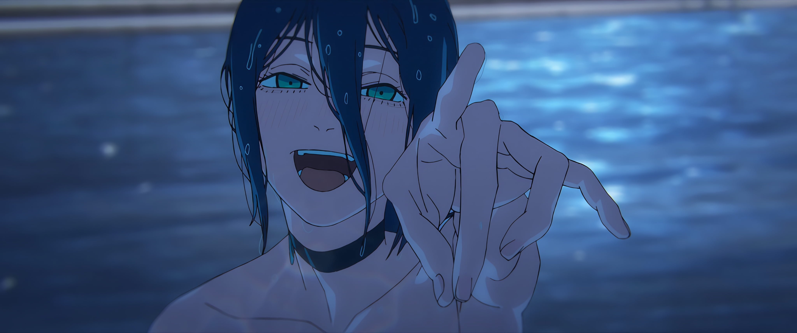</td>
    <td>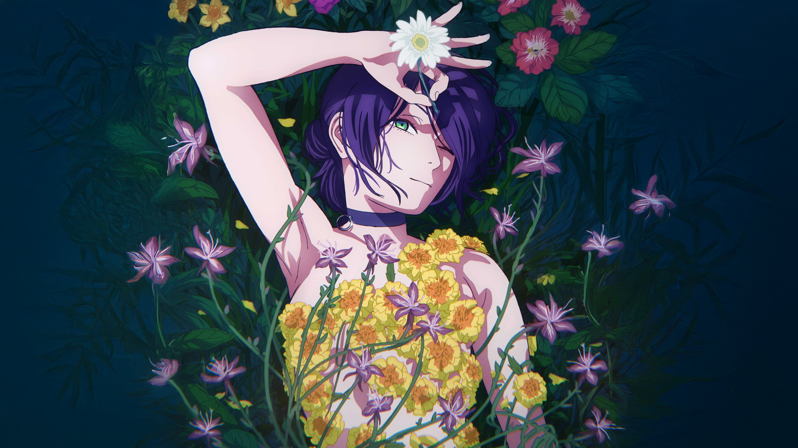</td>
    <td>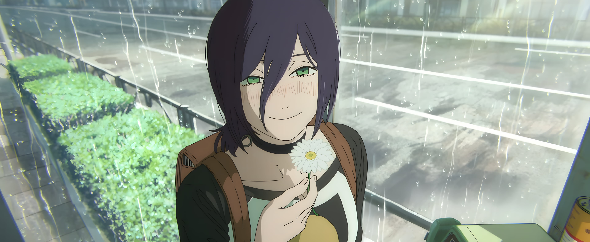</td>
  </tr>
  <tr>
    <td>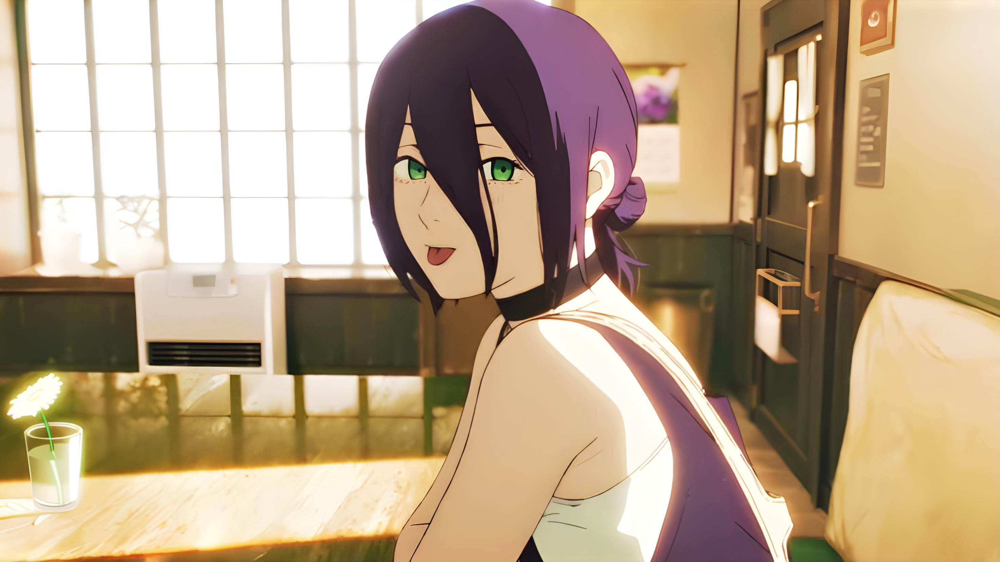</td>
    <td>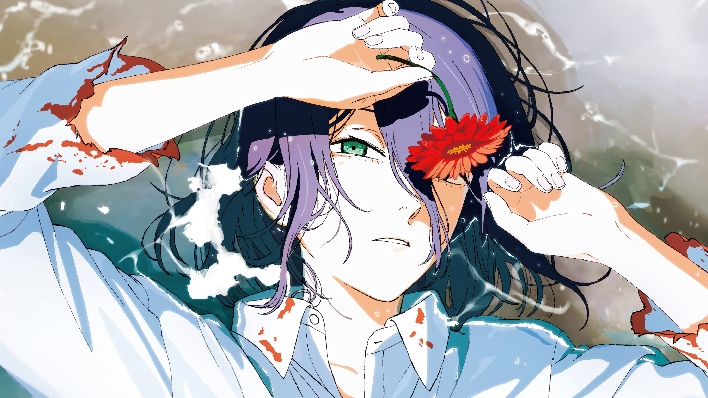</td>
    <td>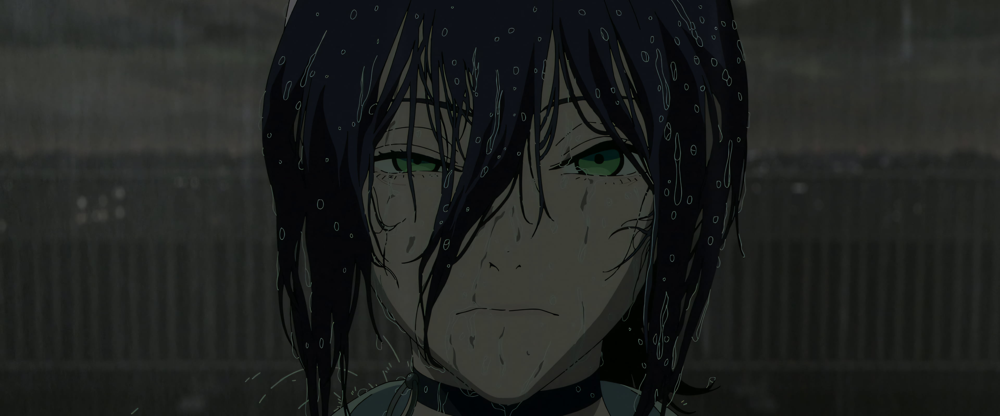</td>
  </tr>
  <tr>
    <td>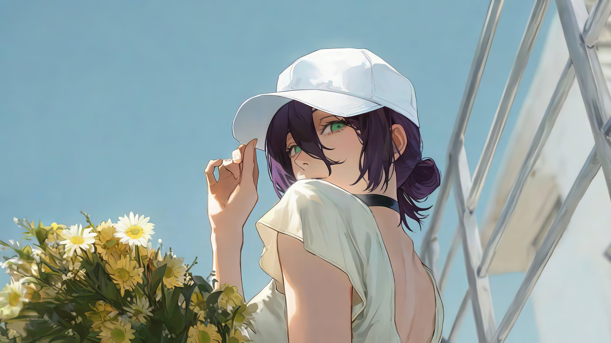</td>
    <td>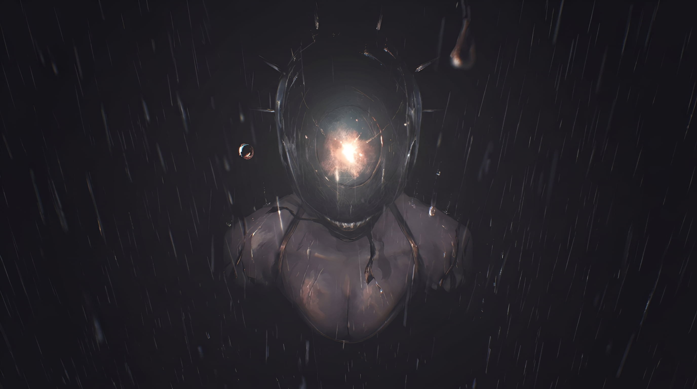</td>
    <td>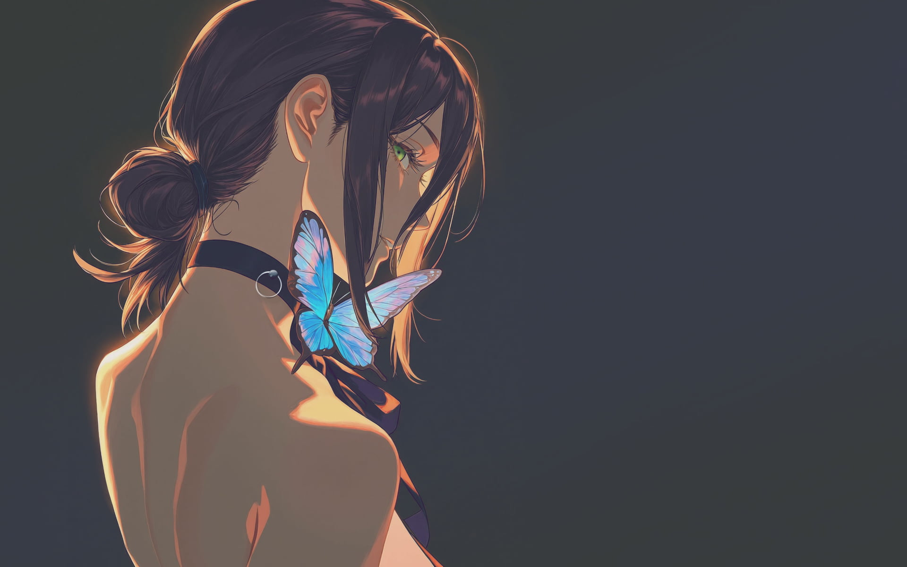</td>
  </tr>
  <tr>
    <td>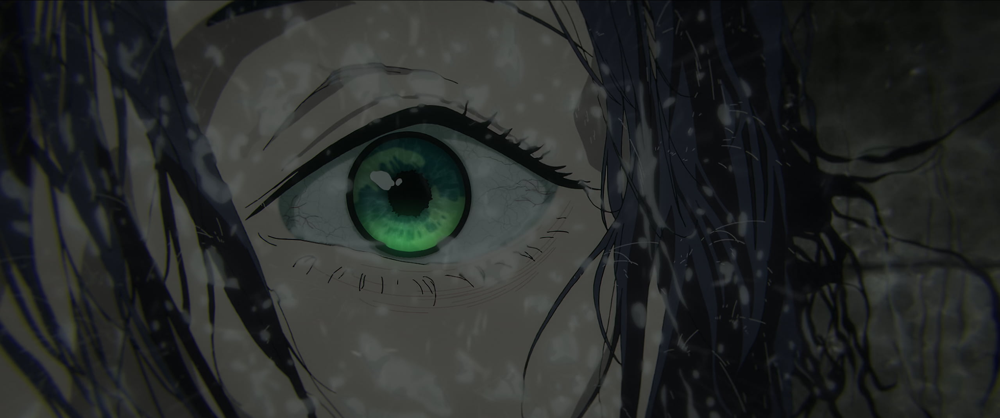</td>
    <td>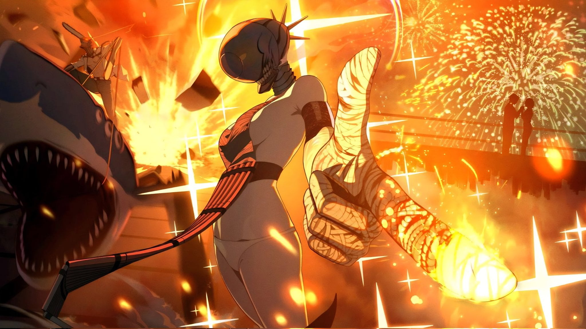</td>
    <td>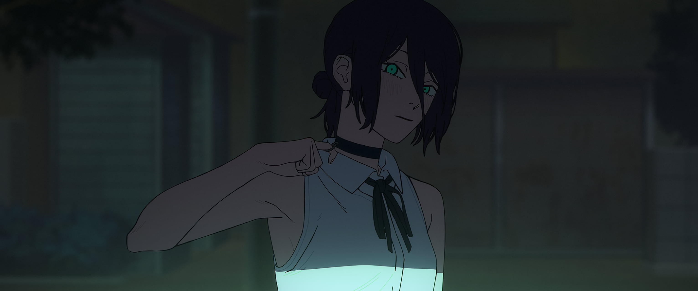</td>
  </tr>
</table>

### Live Wallpapers (.mp4)

The theme bundles 5 animated video loops located in `backgrounds/`:

- `reze-chainsaw-man-1-moewalls-com.mp4` (Chainsaw Man Reze Loop 1)
- `reze-chainsaw-man-moewalls-com.mp4` (Reze Cafe Aesthetic Loop)
- `reze-bomb-devil-chainsaw-man-moewalls-com.mp4` (Bomb Devil Transformation)
- `reze-rainy-night-chainsaw-man-moewalls-com.mp4` (Reze Rainy Night Atmosphere)
- `reze-sunset-serenity-chainsaw-man-moewalls-com.mp4` (Sunset Serenity)

These looping video wallpapers are directly compatible with the [Omarchy Live Wallpaper plugin](https://github.com/yesheytenzin/live-wallpaper) and `mpvpaper`. Once the plugin is installed:
1. Open **Style → Background** (or double-click an empty area on your desktop).
2. Select any video preview to start playback immediately.

## Requirements

- Omarchy 4.0 (Quattro) for native shell and Hyprland Lua treatment
- `Yaru-purple` (or `Yaru-sage`) icon theme
- Optional animated-wallpaper renderer (`mpvpaper` or Omarchy Live Wallpaper plugin) for the bundled MP4 loops
